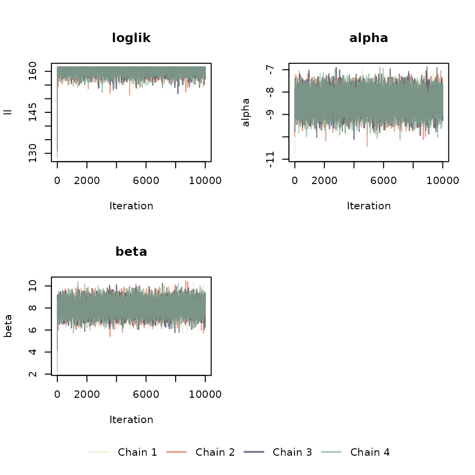

# CoPheScan: Example with Hierarchical Priors

The hierarchical model is ideal when a large set of variants and
phenotypes are available i.e., a phenome-wide association study with a
set of variants which are previously known to have a functional role or
have been implicated in a disease. Here we show how to use cophescan to
infer hierarchical priors on a small test dataset.

``` r
library(cophescan)
library(dplyr)
library(ggplot2)
```

``` r
data("cophe_multi_trait_data")
trait_dat = cophe_multi_trait_data$summ_stat$Trait_1
str(trait_dat)
#> List of 8
#>  $ beta   : Named num [1:1000] -0.01369 0.01666 0.09057 -0.00571 -0.05606 ...
#>   ..- attr(*, "names")= chr [1:1000] "chr19-11173352" "chr19-11173626" "chr19-11173716" "chr19-11173807" ...
#>  $ varbeta: Named num [1:1000] 0.000516 0.000399 0.003124 0.000419 0.000473 ...
#>   ..- attr(*, "names")= chr [1:1000] "chr19-11173352" "chr19-11173626" "chr19-11173716" "chr19-11173807" ...
#>  $ z      : Named num [1:1000] -0.603 0.834 1.62 -0.279 -2.578 ...
#>   ..- attr(*, "names")= chr [1:1000] "chr19-11173352" "chr19-11173626" "chr19-11173716" "chr19-11173807" ...
#>  $ snp    : chr [1:1000] "chr19-11173352" "chr19-11173626" "chr19-11173716" "chr19-11173807" ...
#>  $ MAF    : Named num [1:1000] 0.2614 0.4871 0.0318 0.4046 0.3042 ...
#>   ..- attr(*, "names")= chr [1:1000] "chr19-11173352" "chr19-11173626" "chr19-11173716" "chr19-11173807" ...
#>  $ type   : chr "cc"
#>  $ N      : num 20000
#>  $ s      : num 0.5
querysnpid <- cophe_multi_trait_data$querysnpid
LD <- cophe_multi_trait_data$LD
```

#### Multi-trait analysis

The first step is preparing the input for the hierarchical model which
are the log Bayes factors: lBF.Ha and lBF.Hc. We will use
`cophe.susie.lbf` to extract Bayes factors estimated using SuSIE. Note:
When there are no credible sets identified with SuSIE the function
internally calculates lBF.Ha and lBF.Hc using the Approximate Bayes
Factor method.

``` r
## Hide print messages from coloc
res.multi.lbf <- list()
for (trait_idx in seq_along(cophe_multi_trait_data$summ_stat)) {
    querytrait_ss <- cophe_multi_trait_data$summ_stat[[trait_idx]]
    # Here LD is the same
    querytrait_ss$LD <- LD
    trait_variant_pair <- paste0('Trait', trait_idx, '_', querysnpid)
    res.multi.lbf[[trait_variant_pair]] <- cophe.susie.lbf(
        querytrait_ss,
        querysnpid = querysnpid,
        querytrait = paste0('Trait_', trait_idx)
    )
}

res.multi.lbf.df = bind_rows(res.multi.lbf)
```

``` r
head(res.multi.lbf.df)
#>      lBF.Ha   lBF.Hc nsnps       querysnp querytrait           hit1
#>       <num>    <num> <int>         <char>     <char>         <char>
#> 1: 15.31003 11.95277  1000 chr19-11182353    Trait_1 chr19-11182353
#> 2: 16.43401 13.00673  1000 chr19-11182353    Trait_2 chr19-11182353
#> 3: 17.36744 13.13794  1000 chr19-11182353    Trait_3 chr19-11182353
#> 4: 14.45423 10.44441  1000 chr19-11182353    Trait_4 chr19-11182353
#> 5: 15.82635 12.54912  1000 chr19-11182353    Trait_5 chr19-11182353
#> 6: 16.23052 12.88257  1000 chr19-11182353    Trait_6 chr19-11182353
#>              hit2  typeBF  idx1  idx2
#>            <char>  <char> <int> <int>
#> 1: chr19-11182144 susieBF     1     1
#> 2: chr19-11183133 susieBF     1     1
#> 3: chr19-11189906 susieBF     1     1
#> 4: chr19-11182538 susieBF     1     1
#> 5: chr19-11176397 susieBF     1     1
#> 6: chr19-11182135 susieBF     1     1
```

**Note:**

1.  The output of `cophe.susie` or `cophe.single` can also be used as
    input to the hierarchical model as it has all the fields required
    for the input. This would be useful when you would like to compare
    results from the fixed priors to those obtained from priors inferred
    using the hierarchical model. \[Swap `cophe.susie` for
    `cophe.susie.lbf` above and instead of bind_rows do :
    `res.multi.lbf.df = multitrait.simplify(res.multi.lbf)`\].
2.  Use the for loop (as above) to run large datasets as storing all the
    coloc-structured data in a list is memory-intensive. This is also
    helpful in cases where there are multiple querysnps and different
    regions of the query traits have to be analysed

#### Run hierarchical model for priors

The input df for the multi.dat arguments should contain the following
fields: “lBF.Ha”,“lBF.Hc” and “nsnps”.

Set the argument covar to TRUE to include covariates

``` r
covar = FALSE
covar_vec = rep(1, nrow(res.multi.lbf.df))
## Set covar to TRUE to include covariates, uncomment the following 2 lines
# covar=TRUE
# covar_vec = cophe_multi_trait_data$covar_vec
cophe.hier.res <- run_metrop_priors(
    res.multi.lbf.df,
    avg_posterior = TRUE,
    avg_pik = TRUE,
    covar_vec = covar_vec,
    covar = covar,
    nits = 50000,
    thin = 5
)
names(cophe.hier.res)
#> [1] "ll"            "parameters"    "avg.posterior" "avg.pik"      
#> [5] "data"          "nits"          "thin"
```

Note: Setting posterior or pik to TRUE is memory intensive for very
large datasets

#### Diagnostics of the hierarchical model

Run 3-4 chains of the model and check if there is convergence of chains.
Note: For large datasets run the chains separately and save them in
individual .RData files. These can be loaded later for diagnostics.

``` r
cophe.hier.res.chain.list <- lapply(1:4, function(x) {
    run_metrop_priors(
        res.multi.lbf.df,
        avg_posterior = TRUE,
        avg_pik = TRUE,
        covar_vec = covar_vec,
        covar = covar,
        nits = 50000,
        thin = 5
    )
})
```

``` r
# Store user parameters
old_par <- par(no.readonly = TRUE)

# chain_colors <- c("#e63946c4", "#f1faee", "#a8dadc", "#457b9d" )
chain_colors <- c("#f4f1de", "#e07a5fb2", "#3d405bb2", "#81b29aa6")

layout(
    matrix(c(1, 2, 3, 4, 5, 5), ncol = 2, byrow = TRUE),
    respect = TRUE,
    heights = c(0.9, 0.9, 0.1)
)


matplot(
    sapply(cophe.hier.res.chain.list, function(x) x$ll),
    type = "l",
    col = chain_colors,
    main = "loglik",
    ylab = "ll",
    xlab = "Iteration",
    lty = 1
)

y_ax <- c("alpha", "beta", "gamma")
num_pars <- ifelse(covar, 3, 2)
for (idx in 1:num_pars) {
    matplot(
        sapply(cophe.hier.res.chain.list, function(x) x$parameters[idx, ]),
        type = "l",
        col = chain_colors,
        main = paste(y_ax[idx]),
        ylab = y_ax[idx],
        xlab = "Iteration",
        lty = 1
    )
}

if (!covar) {
    plot(1, type = "n", axes = FALSE, xlab = "", ylab = "")
}

par(mar = c(0, 0, 0, 0))
plot(1, type = "n", axes = FALSE, xlab = "", ylab = "")
legend(
    "top",
    legend = paste("Chain", 1:4),
    col = chain_colors,
    lty = 1,
    lwd = 2,
    horiz = TRUE,
    bty = "n"
)
```



``` r

# Reset user parameters
par(old_par)
```

#### Prediction

`cophe.hier.res.chain.list[[1]]$avg.posterior` contains the posterior
probabilities of the hypotheses : $H_{n}$, $H_{a}$ and $H_{c}$ for the
queryvariant/querytrait pairs obtained from the hierarchical model. Here
we use the first chain for prediction.

``` r
res.post.prob = cbind(
    cophe.hier.res.chain.list[[1]]$avg.posterior,
    cophe.hier.res$data
)
```

We can use the `cophe.hyp.predict` function to predict the hypothesis
given the posterior probabilities. The cophe.hyp.call column shows the
predicted hypothesis for each query trait-query variant pair.

``` r
res.hier.predict <- cophe.hyp.predict(as.data.frame(res.post.prob))
#> Hc.cutoff = 0.6
#> Hn.cutoff = 0.2
col_disp <- c(
    "PP.Hn",
    "PP.Ha",
    "PP.Hc",
    "nsnps",
    "querysnp",
    "querytrait",
    "typeBF",
    "grp",
    "cophe.hyp.call"
)
knitr::kable(
    res.hier.predict[, col_disp],
    row.names = FALSE,
    digits = 3,
    align = "c"
)
```

| PP.Hn | PP.Ha | PP.Hc | nsnps |    querysnp    | querytrait | typeBF  |           grp           | cophe.hyp.call |
|:-----:|:-----:|:-----:|:-----:|:--------------:|:----------:|:-------:|:-----------------------:|:--------------:|
| 0.772 | 0.099 | 0.128 | 1000  | chr19-11182353 |  Trait_17  |   ABF   | chr19-11182353_Trait_17 |       Hn       |
| 0.790 | 0.073 | 0.137 | 1000  | chr19-11182353 |  Trait_18  |   ABF   | chr19-11182353_Trait_18 |       Hn       |
| 0.797 | 0.083 | 0.119 | 1000  | chr19-11182353 |  Trait_19  |   ABF   | chr19-11182353_Trait_19 |       Hn       |
| 0.800 | 0.073 | 0.127 | 1000  | chr19-11182353 |  Trait_20  |   ABF   | chr19-11182353_Trait_20 |       Hn       |
| 0.693 | 0.058 | 0.250 | 1000  | chr19-11182353 |  Trait_21  |   ABF   | chr19-11182353_Trait_21 |       Hn       |
| 0.656 | 0.077 | 0.266 | 1000  | chr19-11182353 |  Trait_22  |   ABF   | chr19-11182353_Trait_22 |       Hn       |
| 0.789 | 0.081 | 0.130 | 1000  | chr19-11182353 |  Trait_23  |   ABF   | chr19-11182353_Trait_23 |       Hn       |
| 0.806 | 0.074 | 0.120 | 1000  | chr19-11182353 |  Trait_24  |   ABF   | chr19-11182353_Trait_24 |       Hn       |
| 0.000 | 0.999 | 0.000 | 1000  | chr19-11182353 |  Trait_9   | susieBF | chr19-11182353_Trait_9  |       Ha       |
| 0.001 | 0.999 | 0.000 | 1000  | chr19-11182353 |  Trait_10  | susieBF | chr19-11182353_Trait_10 |       Ha       |
| 0.000 | 1.000 | 0.000 | 1000  | chr19-11182353 |  Trait_11  | susieBF | chr19-11182353_Trait_11 |       Ha       |
| 0.002 | 0.998 | 0.000 | 1000  | chr19-11182353 |  Trait_12  | susieBF | chr19-11182353_Trait_12 |       Ha       |
| 0.001 | 0.999 | 0.000 | 1000  | chr19-11182353 |  Trait_13  | susieBF | chr19-11182353_Trait_13 |       Ha       |
| 0.000 | 0.999 | 0.000 | 1000  | chr19-11182353 |  Trait_14  | susieBF | chr19-11182353_Trait_14 |       Ha       |
| 0.000 | 1.000 | 0.000 | 1000  | chr19-11182353 |  Trait_15  | susieBF | chr19-11182353_Trait_15 |       Ha       |
| 0.000 | 1.000 | 0.000 | 1000  | chr19-11182353 |  Trait_16  | susieBF | chr19-11182353_Trait_16 |       Ha       |
| 0.000 | 0.011 | 0.989 | 1000  | chr19-11182353 |  Trait_1   | susieBF | chr19-11182353_Trait_1  |       Hc       |
| 0.000 | 0.011 | 0.988 | 1000  | chr19-11182353 |  Trait_2   | susieBF | chr19-11182353_Trait_2  |       Hc       |
| 0.000 | 0.025 | 0.975 | 1000  | chr19-11182353 |  Trait_3   | susieBF | chr19-11182353_Trait_3  |       Hc       |
| 0.000 | 0.020 | 0.979 | 1000  | chr19-11182353 |  Trait_4   | susieBF | chr19-11182353_Trait_4  |       Hc       |
| 0.000 | 0.010 | 0.990 | 1000  | chr19-11182353 |  Trait_5   | susieBF | chr19-11182353_Trait_5  |       Hc       |
| 0.000 | 0.011 | 0.989 | 1000  | chr19-11182353 |  Trait_6   | susieBF | chr19-11182353_Trait_6  |       Hc       |
| 0.000 | 0.008 | 0.992 | 1000  | chr19-11182353 |  Trait_7   | susieBF | chr19-11182353_Trait_7  |       Hc       |
| 0.000 | 0.013 | 0.987 | 1000  | chr19-11182353 |  Trait_8   | susieBF | chr19-11182353_Trait_8  |       Hc       |

#### Visualisation

Use the `cophe_plot` function to return -log10(pval), ppHa and ppHc
PheWAS plots from the cophescan output.

``` r
res.plots = cophe_plot(
    res.hier.predict,
    traits.dat = cophe_multi_trait_data$summ_stat,
    querysnpid = querysnpid,
    query_trait_names = paste0('Trait_', 1:24)
)

# if (!require(ggpubr)) {
# install.packages("ggpubr")
# }
# ggpubr::ggarrange(res.plots$pval, res.plots$ppHa, res.plots$ppHc, ncol = 2,
#                 nrow = 2)
```


Note: For large datasets, it’s not feasible to input all
coloc-structured data into “traits.dat” at once. Instead, use a loop and
run the “get_beta” function over all the trait-variant pairs, and
provide the resulting data frame (after binding the rows) as the
“beta_p” argument in `cophe_plot`:

``` r
# beta_p_list <- lapply(seq_along(cophe_multi_trait_data$summ_stat),  function(x) get_beta(list(cophe_multi_trait_data$summ_stat[[x]]), querysnpid, names(cophe_multi_trait_data$summ_stat)[x]))
# ### the datasets need not be in a list as in cophe_multi_trait_data$summ_stat and can be stored independently.
# beta_p_df = bind_rows(beta_p_list)
# ### Make sure the query trait names in beta_p_df are the same as in res.hier.predict
# res.plots = cophe_plot(res.hier.predict,  querysnpid = querysnpid, query_trait_names = beta_p_df$querytrait, beta_p = beta_p_df)
```

------------------------------------------------------------------------
